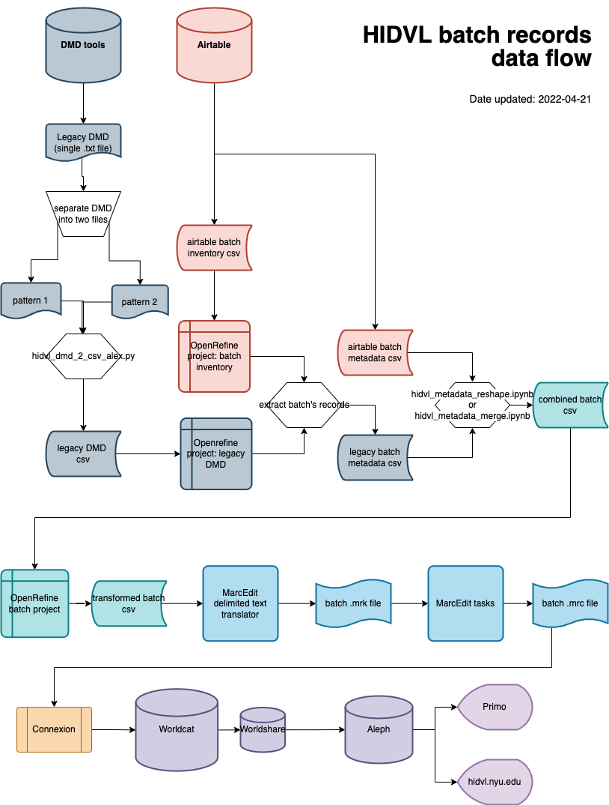

# karms-hidvl-draft-marc

Scripts and files for creating draft MARC records based on Hemispheric Institute metadata. After further editing and enhancement by a cataloger, these records populate [hidvl.nyu.edu](https://hidvl.nyu.edu).

## Draft record workflow overview

[Batch record diagram](https://drive.google.com/file/d/1gWUqxvRTumpFdjmyIVvqtbZIFlv02iG2/view?usp=sharing)

## System requirements

- OpenRefine
- JupyterLab and Python 3
- MarcEdit (PC or Mac)

## Processing instructions

[Step-by-step instructions](https://docs.google.com/document/d/1Syyzh_Iy4DjktGThr0vgyKXEFc-1HkLFU4ftt27r3lY/edit?usp=sharing) are available via Google docs (NYU account required).